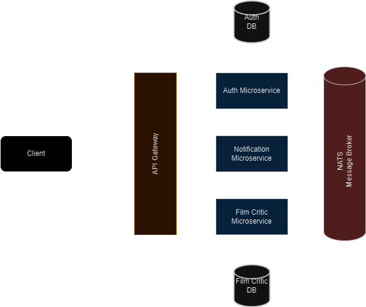

  

## What's Film Critics?

Film Critics is platform where film enthusiasts can share their honest opion of their favorite or not so favorite films. Providing ratings and and interacting with the comunity.

## Motivation

This is a personal project intented mainly to update my professional portafolio and showcase my domain knowledge of backend development.

## How to use it

1. Create the `auth.env`, `film-critic.env`, `notification.env` files inside the `.env` folder, and the `postgres.env` file inside the `postgres` folder. Copy the default values from each one of the `.env.example` files to it's corresponding `.env` file and fill the empty fields with your prefered values.
2. Install [Docker](https://docs.docker.com/) if you don't have it already , run the `docker-compose up` command. The API will be listening for your requests at http://localhost:80.

## What's the stack used in this project?

- **[Nest.js](https://nestjs.com/)** is a [TypeScript](https://www.typescriptlang.org/)-based Node.js API framework for building efficient, scalable server-side applications.
- **[Postgres](https://www.postgresql.org/)** a very well known open source object-relational database system.
- **[TypeORM](https://typeorm.io/)** is an ORM built on [TypeScript](https://www.typescriptlang.org/).
- **[Nats](https://nats.io/)** offers a lightweight, scalable, and efficient messaging system for building distributed applications.
- **[Nodemailer](https://nodemailer.com/)** is a Node.js module that allows you to send emails from your server with ease.

## Architecture

  

## API Documentation

[Postman API Documentation](https://documenter.getpostman.com/view/10986690/2s9YJXakff)

## Current version

### 0.9.0

**What's missing?**

- Wide unit tests coverage with mocked up dependencies.
- Improved and more extensive validations.
- Add database transactions to certain operations.
